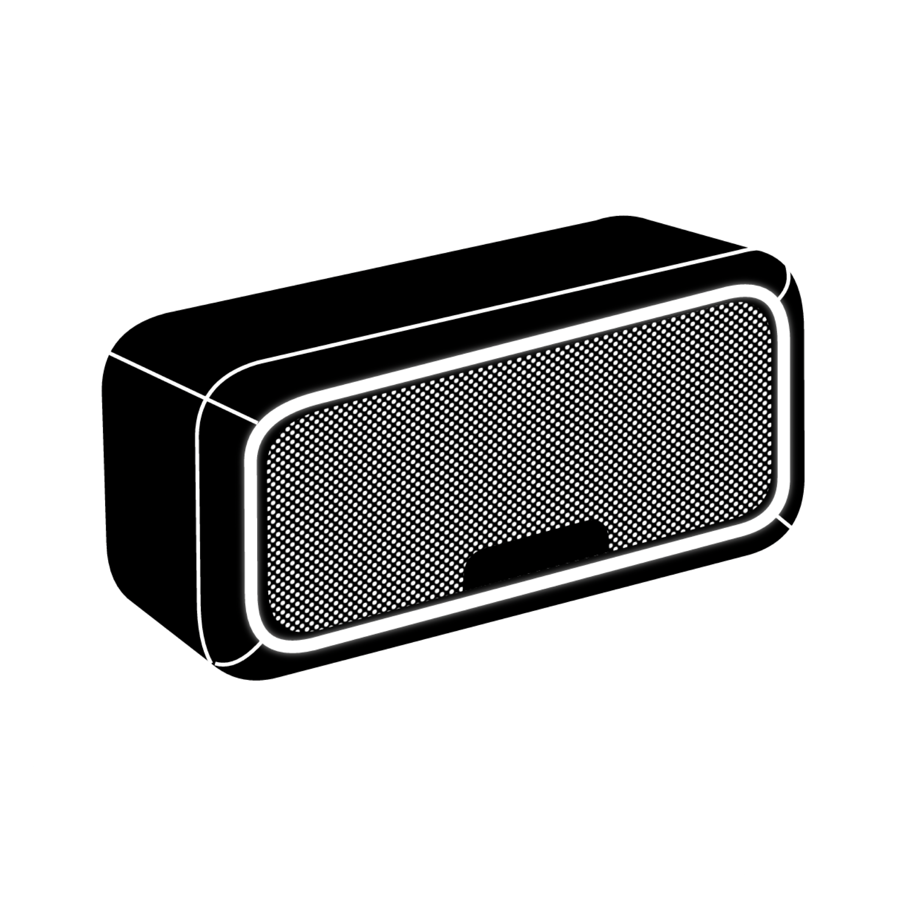
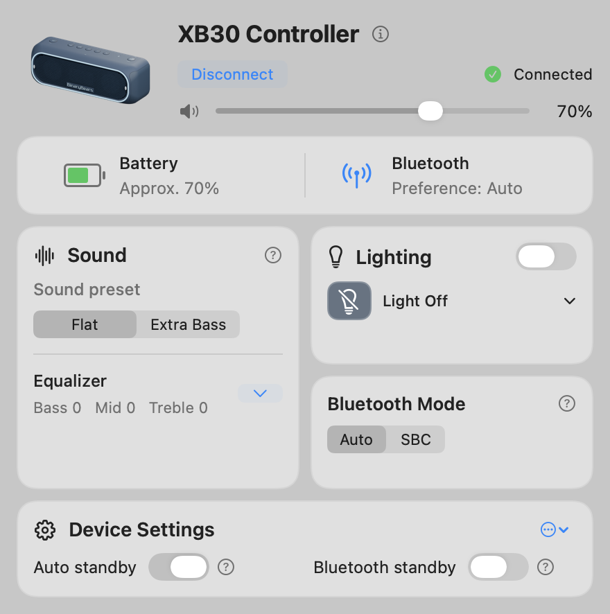

<h1 align="center">XB30 Controller</h1>

Sound and lighting for your SRS-XB30, right in the Mac menu bar.

<a href="https://github.com/BinaryBearsLLC/SRS-XB30-MacOS/releases/latest">Download for macOS</a> · <a href="https://binarybearsllc.github.io/SRS-XB30-MacOS/">Interactive demo</a> · <a href="https://binarybears.com">BinaryBears</a>

**macOS 13+ · Apple Silicon & Intel · SRS-XB30 only**

Change volume, Flat/Extra Bass, three-band EQ, lighting and standby settings. Controls apply immediately and verify the speaker’s response in the background. The panel expands with EQ; right-click the menu bar icon to quit.

Pair the speaker in macOS Bluetooth Settings, open the app and click **Connect**. Extra Bass also enables ClearAudio+ on this model. Battery readings are approximate; the speaker may limit maximum volume until charged. Auto/SBC selects a Bluetooth preference, not a guaranteed active codec.

Build locally with `./build.sh`; run offline checks with `./test.sh`. See [development and release notes](docs/DEVELOPMENT.md) for the protocol, packaging and GitHub signing workflow. Download links become available after the first approved release; local previews are ad-hoc signed, not notarized.

Made by [BinaryBears](https://binarybears.com). Independent software, not affiliated with Sony.
